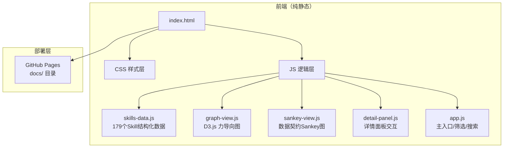

## 1. 架构设计



纯前端静态站点，无后端、无数据库、无构建步骤。所有数据内嵌 JS 文件，CDN 加载第三方库。

## 2. 技术说明

- **前端框架**：纯 HTML + CSS + JavaScript（无 React/Vue，确保 GitHub Pages 零配置部署）
- **样式方案**：Tailwind CSS (CDN) + 自定义 CSS 变量
- **图谱渲染**：D3.js v7 (CDN) — 力导向图 + Sankey 图
- **字体**：Google Fonts — Sora + DM Sans + Noto Sans SC
- **图标**：Lucide Icons (CDN)
- **数据**：内嵌 JSON（skills-data.js）
- **部署**：GitHub Pages，发布目录 docs/

## 3. 路由定义

单页应用，无前端路由。通过锚点滚动和视图切换实现区域导航：

| 锚点 | 区域 |
|------|------|
| #hero | Hero 区域 |
| #graph | 交互图谱 |
| #contracts | 数据契约流 |
| #modules | 模块卡片 |

## 4. 数据结构

### 4.1 Skill 数据模型

```typescript
interface SkillNode {
  id: string;
  name: string;
  type: "domain" | "module" | "orchestrator" | "pipeline";
  domain: "pm" | "ui" | "backend" | "cross";
  moduleId?: string;
  moduleName?: string;
  description: string;
  brief?: string;
  input?: string[];
  output?: string[];
  version?: string;
  interactionMode?: string;
  children?: string[];
}

interface DataContract {
  id: string;
  name: string;
  from: string;
  to: string;
  fromDomain: string;
  toDomain: string;
  description: string;
}

interface SkillsData {
  domains: Domain[];
  contracts: DataContract[];
}
```

## 5. 文件结构

```
docs/
├── index.html
├── css/
│   └── styles.css
├── js/
│   ├── skills-data.js
│   ├── graph-view.js
│   ├── sankey-view.js
│   ├── detail-panel.js
│   └── app.js
└── assets/
    └── favicon.svg
```

## 6. 性能策略

| 策略 | 实现 |
|------|------|
| 力导向图预计算 | 初始300次迭代后渲染，避免卡顿 |
| Pipeline 节点折叠 | 默认只显示编排器，Pipeline 折叠为小圆点 |
| 懒加载详情 | 详情面板内容按需渲染 |
| 缩放节流 | zoom 事件 16ms 节流 |
| 减少动画 | prefers-reduced-motion 媒体查询 |
| CDN 缓存 | 第三方库使用 CDN，利用浏览器缓存 |
