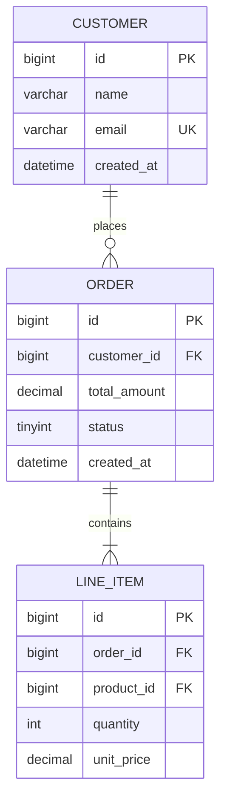

# Pipeline 15: 数据模型自动设计

## 核心原则

1. **范式与反范式平衡**：写密集场景遵循3NF，读密集场景适度反范式
2. **索引精准**：每个索引有明确的查询场景支撑，不为"可能用到"建索引
3. **扩展预留**：核心表预留扩展字段，避免频繁DDL
4. **软删除优先**：业务数据默认软删除，保留数据追溯能力

## 交互模式

🤖→👤 AI建议人类审批

## 输入

| 输入项 | 类型 | 必填 | 来源 | 说明 |
|--------|------|------|------|------|
| PRD | markdown | 是 | output/pm-design/design-prd/prd.md | 业务实体和关系需求 |
| API契约 | YAML/JSON | 是 | output/backend-api-design/api-contract/openapi.yaml | 接口数据结构定义 |
| 数据量预估 | JSON | ○ | 用户提供 | 核心表数据量级和增长速度 |

## 执行步骤

### Step 1: 实体识别与关系建模

从PRD和API契约中提取数据实体：

- 识别核心业务实体（名词提取）
- 确定实体间关系（1:1 / 1:N / N:M）
- 标注关系的基数和可选性
- 生成ER图

**关系映射规则**：
- 1:1 → 主表加外键 + UNIQUE约束
- 1:N → 子表加外键
- N:M → 创建关联表

### Step 2: 表结构设计

为每个实体设计表结构：

| 设计要素 | 规范 |
|----------|------|
| 主键 | BIGINT AUTO_INCREMENT 或 UUID v7 |
| 外键 | 逻辑外键（应用层保证），不建物理外键 |
| 时间戳 | created_at + updated_at，DATETIME(3)毫秒精度 |
| 软删除 | deleted_at DATETIME NULL，NULL=未删除 |
| 状态字段 | TINYINT + CHECK约束 + 注释说明枚举值 |
| 金额字段 | DECIMAL(18,2)，不用FLOAT/DOUBLE |
| 字符串 | VARCHAR + 明确长度，TEXT仅用于长文本 |
| JSON字段 | 仅用于灵活扩展，不用于核心查询字段 |

**通用字段规范**：
```
id           BIGINT       PRIMARY KEY AUTO_INCREMENT
created_at   DATETIME(3)  NOT NULL DEFAULT CURRENT_TIMESTAMP(3)
updated_at   DATETIME(3)  NOT NULL DEFAULT CURRENT_TIMESTAMP(3) ON UPDATE CURRENT_TIMESTAMP(3)
deleted_at   DATETIME(3)  NULL
created_by   BIGINT       NULL
updated_by   BIGINT       NULL
```

### Step 3: 索引策略设计

为每个表设计索引：

| 索引类型 | 适用场景 | 规范 |
|----------|---------|------|
| 主键索引 | 每表必有 | BIGINT自增或UUID v7 |
| 唯一索引 | 业务唯一约束 | 命名uk_{table}_{column} |
| 联合索引 | 多条件查询 | 最左前缀原则，区分度高的列在前 |
| 覆盖索引 | 高频查询 | 包含SELECT和WHERE的全部列 |
| 全文索引 | 文本搜索 | 仅MySQL FULLTEXT或ES |

**索引决策规则**：
- 单表索引数≤8个
- 联合索引列数≤4个
- 区分度<10%的列不单独建索引
- 每个索引必须有明确的查询SQL支撑

### Step 4: 分库分表评估

评估是否需要分库分表：

| 数据量级 | 策略 |
|----------|------|
| 单表<500万行 | 单库单表 |
| 单表500万-5000万 | 评估分表（按时间/ID哈希） |
| 单表>5000万 | 必须分表+评估分库 |
| 单库总数据>100GB | 评估分库 |

**分片键选择规则**：
- 优先选择业务维度（租户ID/用户ID）
- 分片后跨片查询≤10%
- 分片键不可修改

### Step 5: DDL与数据字典生成

生成数据库DDL和数据字典：

- MySQL/PostgreSQL DDL语句
- 数据字典（表说明+字段说明+枚举值+索引说明）
- 初始数据SQL（枚举表/配置表）
- ER图（Mermaid格式）

**Mermaid ER图语法模板**：


**关系语法**：
- `||--||` 一对一
- `||--o{` 一对多（一个XX有零到多个YY）
- `||--|{` 一对多（一个XX有一个到多个YY）

## 输出

**存储路径**：`output/backend-data-architecture/data-model/`

**输出文件**：er_model.json, schema.sql

```json
{
  "model_metadata": {
    "total_tables": 18,
    "total_indexes": 35,
    "total_relationships": 12,
    "database": "MySQL 8.0"
  },
  "tables": [
    {
      "name": "courses",
      "description": "课程表",
      "columns": 15,
      "indexes": 4,
      "estimated_rows": "100万",
      "sharding": "none"
    }
  ],
  "relationships": [
    { "from": "courses", "to": "users", "type": "N:M", "through": "enrollments" }
  ],
  "files": [
    { "path": "ddl/001_create_tables.sql", "type": "ddl" },
    { "path": "ddl/002_create_indexes.sql", "type": "ddl" },
    { "path": "ddl/003_init_data.sql", "type": "ddl" },
    { "path": "docs/data_dictionary.md", "type": "doc" },
    { "path": "docs/er_diagram.mmd", "type": "diagram" }
  ]
}
```

## 决策规则

| 条件 | 决策 |
|------|------|
| 单表预估>500万行 | 设计分表方案 |
| 单表预估>5000万行 | 设计分库分表方案 |
| 读多写少（读写比>10:1） | 适度反范式，冗余减少JOIN |
| 写多读少 | 严格3NF，减少写放大 |
| 金额相关字段 | DECIMAL(18,2)，不用FLOAT |
| 跨片查询>10% | 重新选择分片键 |

## 质量检查

- [ ] 每个表有主键+created_at+updated_at+deleted_at
- [ ] 每个外键关系有索引支撑
- [ ] 单表索引数≤8个
- [ ] 金额字段100%使用DECIMAL
- [ ] 数据字典覆盖100%的表和字段
- [ ] 分库分表方案有数据量级支撑

## 降级策略

| 缺失的上游输入 | 降级方案 | 输出影响 |
|---------------|---------|---------|
| 数据量预估缺失 | 默认单库单表，标注"待数据量评估" | 可能需要后续分库分表 |
| API契约缺失 | 基于PRD推导数据结构 | 字段可能不完整 |
| PRD缺失 | 无法设计数据模型 | 输出为空 |

数据获取说明：
- 本Skill需要PRD和API契约，请通过以下方式之一提供：
  1. 上传prd.md和openapi.yaml文件
  2. 描述核心业务实体和数据量级
  3. 提供现有数据库Schema（用于增量设计）
